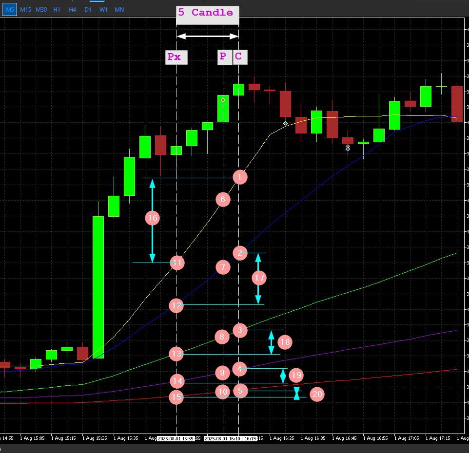

* # CheckMAConditions (UP, DOWN, UNDEFINED)

 - Check 4 MA(20,40,80,240) in same Period  
 - MAC = MA-Current
 - MAP = MA-Previous

    ## Validation  
    IF   MAC20 > MAC40 > MAC80 > MAC240  
    &&  MAC20 > MAP20  
    &&  MAC40 > MAP40  
    &&  MAC80 > MAP80  
    &&  MAC240 > MAP240  
    ==> (UP:UP) 
     
    ELSE 
    MAC20 < MAC40 < MAC80 < MAC240 
    &&  MAC20 < MAP20 
    &&  MAC40 < MAP40  
    &&  MAC80 < MAP80  
    &&  MAC240 < MAP240  
    ==> (DW:DOWN) 
     
    ELSE 
    (XX:UNDEFINED)

